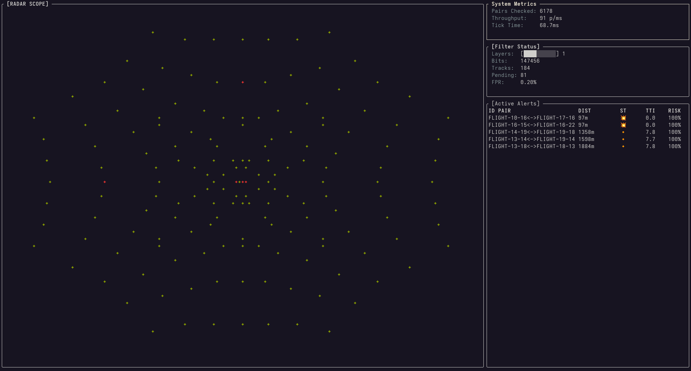

# ACTSim 

ACTSim is a high-performance air collision tracking simulation and collision risk monitoring tool.
It processes live ADS-B data streams, filters duplicate or transient signals using a scalable Bloom filter,
and simulates aircraft movement with spatial awareness to detect potential collisions.  
Includes an interactive terminal user interface (TUI) for real-time visualization and monitoring.

Key Features

- **Real-Time Filtering**  
    Uses a Scalable Bloom Filter to track aircraft signals efficiently, distinguishing between new, pending, promoted, and trusted aircraft updates.
- **Accurate Collision Detection**  
    Implements a **spatial grid** to reduce computational complexity and a **Monte Carlo approach** to estimate collision risk between aircraft.
- **Aircraft Tracking & History**  
    Maintains aircraft positions, velocities, altitude, and historical trajectory for precise movement simulation.
- **ADS-B Stream Integration**  
    Reads live or recorded ADS-B packets in JSON format.
- **Pruning & Performance Optimization**  
    Automatically removes outdated aircraft data and adjusts Bloom filter layers to maintain efficiency and low false-positive rates.
- **Debug & Reporting**  
    Outputs real-time alerts with estimated collision risk and aircraft proximity, with optional debug statistics for developers.
- **Interactive TUI**
  Real-time radar-style aircraft visualization, live collision alerts, Bloom filter status, and system performance metrics rendered directly in the terminal.
 
## Testing
```shell
cargo test
```

## Running  

```shell
cargo run
```

Options
```shell
cargo run -- -h
```

## Examples

Run the ADS-B filter against a test data stream
```shell
./tools/adsb_gen.py | cargo run -- filter
NEW:    17DDE3
NEW:    BA344C
NEW:    DF9C6D
NEW:    372D6C
NEW:    2258C3
NEW:    136A77
NEW:    74AB7C
NEW:    42F157
MATCH:  136A77 (Est. FPR: 1.5625%)
MATCH:  372D6C (Est. FPR: 1.5625%)
MATCH:  2258C3 (Est. FPR: 1.5625%)
NEW:    B89861
MATCH:  74AB7C (Est. FPR: 1.5625%)
MATCH:  17DDE3 (Est. FPR: 1.5625%)
MATCH:  BA344C (Est. FPR: 1.5625%)
NEW:    EB9C72
[...]
```

Run simulation on a 200km scale plane, with 4096 aircraft flying into the center and up to 64 noise packets/s
```shell
./tools/adsb_gen.py --planes 1024 --noise 64 --mode grid | cargo run -- simulate
```

